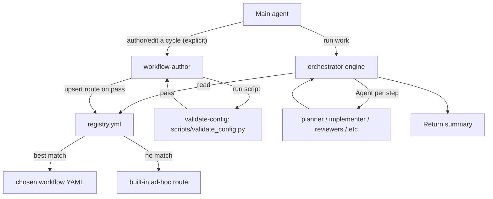

# Orchestral harness (generic workflow engine + self-service registry + skill scripts)

## Goal
A reusable harness where the user just talks. Handled automatically, no tagging:
- **Run work** -> `orchestrator` selects the matching workflow from the registry and runs it with enforced gates; ad-hoc fallback when nothing matches.
- **Author a cycle** (explicit workflow/cycle/pipeline mention) -> `workflow-author` scaffolds the YAML, runs the validator script, and registers it only on pass.

Deterministic checks run as **real bundled scripts** inside skills. The orchestrator has explicit **robustness rules** so it degrades gracefully, not just on the happy path.

## Execution model (important)
This is **not a compiled engine**. `registry.yml`, the workflow YAMLs, and fields like `match`, `on_complete`, `max_retries` are **conventions the `orchestrator` LLM reads and follows via its system prompt** — Claude Code has no native knowledge of them. Guarantees come from two places only: the **orchestrator prompt** (sequence/gate enforcement via instruction-adherence) and the **`validate_config.py` script** (the one deterministic check). Auto-delegation to `orchestrator`/`workflow-author` depends on their `description` quality, so both descriptions are written for reliable routing (e.g. proactive phrasing).

## Architecture



## General scripts in skills (deterministic tooling)
### New skill: `.claude/skills/validate-config/`
- `SKILL.md` - when to run + how to read results. `allowed-tools: Bash, Read`.
- `scripts/validate_config.py` - permanent validator. Parses all agents/skills/workflows/`registry.yml`; **skips `_`-prefixed workflows**; checks required + known frontmatter fields, agent `skills:` refs, registry route -> workflow file, workflow step `agent`/`skill` -> existing, `fallback` value, recursion guard (no step references `orchestrator`/`workflow-author`), and verdict-contract presence on gated steps. UTF-8 stdout.
- **G-F exit policy:** exit non-zero on **ERRORS only**; warnings are informational and never block a registration. This prevents an unrelated pre-existing warning from blocking new work.
- **Incremental mode:** optional target-file arg (`validate_config.py <path>`) validates only the changed workflow (fast path for authoring); full scan reserved for verification/CI.
- Reused by `workflow-author` (pre-register gate), final verification, and any "validate the .claude config" request.

## New file: `.claude/agents/orchestrator.md`
```yaml
---
name: orchestrator
description: Generic workflow harness. For any request to run/do/implement work, selects the matching workflow from registry.yml and runs it end-to-end, spawning each step's agent in order with enforced gates. Falls back to an ad-hoc route when nothing matches.
model: sonnet
tools: Agent, Read, Grep, Glob, TodoWrite
---
```
Body = fixed execution algorithm (workflow-agnostic):
- **Select** route (explicit name -> best `match.intent` among `enabled`, ties by `priority` then order -> ad-hoc -> if registry bad, ad-hoc + note). Read **only `registry.yml`** to route, then load only the selected workflow file. Ignore `_`-prefixed files.
- **Pick execution tier (cost control):** trivial -> not here (handled direct); small/low-risk multi-file -> **fast lane** (`execute -> review + test`, skip planning/plan-review/breakdown); feature/high-risk/cross-module -> **full cycle**. Steps marked `mandatory: false` are dropped for lighter tiers.
- **Load** `steps`; write a `TodoWrite` checklist.
- **Execute** each step in dependency order: spawn its `agent` via `Agent`, injecting `action` + resolved `input`/`output` + prior summary. Spawn `parallel_with` steps together.
- **Gates:** on `on_complete`, match the returned verdict against the declared **verdict contract**; branch (loop `requires` up to `max_retries`, or continue).
- **Robustness rules:**
  - **G-A hard-failure policy:** if a spawned agent errors, times out, hits `maxTurns`, or returns an unusable/unrecognized verdict, retry once; if it fails again, stop and report a partial summary (do not silently continue). A verdict outside the contract counts as a failure.
  - **G-C placeholder resolution:** resolve `{project-name}` from repo/`docs/`; resolve `{NN}` to the highest existing `docs/specs/phase-*` or `phase-01` if none. The **ad-hoc route uses scratch paths** (`docs/plans/adhoc-{slug}-*`), never phase paths.
  - **G-D parallel join:** wait for all `parallel_with` steps; pass the gate only if all succeed; route any failure to `debugger`, then re-run the failed steps (capped by `max_retries`).
  - **Recursion guard:** never spawn `orchestrator` or `workflow-author` as a step agent.
- **Ad-hoc route:** `implementer` -> (`code-reviewer` + `test-expert` parallel; tests only if code changed) -> `debugger` on issues. (Optional: use `adhoc-cycle.yml` if present.)
- **Escalate** to user only at `type: manual` steps or genuine decisions/destructive actions/ambiguity.
- **Return** summary: workflow run, per-step outcomes, artifacts, residual risk. No `Write`/`Edit`/`Bash`.

## Registry (routing source)
```yaml
name: Workflow Registry
version: "1.0"
fallback: adhoc
routes:
  - id: dev-cycle
    workflow: dev-cycle.yml
    description: Feature, change, bug fix, or refactor of code
    match: { intent: [implement, feature, change, bug, fix, refactor, endpoint, UI], priority: 50 }
    enabled: true
```

## New file: `.claude/skills/author-workflow/SKILL.md`
Procedure: gather intent/steps/gate verdicts -> copy `_template.yml` to `.claude/workflows/{id}.yml`, fill `match`/`steps`/gates (verdict contract + `max_retries`) -> **run `python .claude/skills/validate-config/scripts/validate_config.py`; proceed only on exit 0** -> **G-E upsert:** if `{id}` already exists in `registry.yml`, update that route in place (never duplicate); else append an `enabled` route -> re-run validator -> report. Never register a file that fails validation.

## New file: `.claude/agents/workflow-author.md`
```yaml
---
name: workflow-author
description: Creates or edits workflow definitions and registers them in registry.yml. Use only when the user explicitly mentions a workflow, cycle, pipeline, route, or the registry.
model: sonnet
tools: Read, Write, Edit, Grep, Glob, Bash
skills: [author-workflow]
---
```
This agent is **privileged** (can modify `.claude/` config and run shell). Scope its `Bash` in `settings.json` to the validator command only, and keep it reachable exclusively through explicit workflow/cycle/pipeline/route mentions (never from the orchestrator - see recursion guard).

## New file: `.claude/workflows/_template.yml`
Commented skeleton: `match` block, `steps` (`agent`/`skill`/`requires`/`parallel_with`/`input`/`output`), and an `on_complete` gate example showing the **verdict contract** (exact tokens the step's agent returns) + `max_retries`.

## Edit: `.claude/workflows/dev-cycle.yml`
- Add `match:`; remove older `mode: auto`/`trigger:` metadata (match wins). `plan-reviewer` step gains explicit verdict contract (`APPROVE` / `APPROVE WITH CHANGES` / `REVISE`).
- Mark `review-plan` and `task-breakdown` as `mandatory: false` with a skip condition so the **fast lane** can drop them for small/low-risk changes.

## Cost efficiency and process optimization
Built in because the harness multiplies subagent calls.
- **Model tiering (biggest lever):** set per-agent `model:` to match need - routing/`plan-reviewer`/`code-reviewer` -> `haiku`; `planner`/`implementer`/`debugger` -> `sonnet` (`opus` only high-risk); `validate-config` is a script (~free). Applies to new agents and retiers existing reviewers.
- **Tiered execution:** trivial -> direct; fast lane (`execute -> review + test`) for small/low-risk; full cycle only for feature/high-risk. Driven by `mandatory: false` + skip conditions.
- **Context economy:** route from `registry.yml` only; load one workflow file; staged spec loading; pass summaries + paths (not full contents) between subagents; scope reviews to the diff.
- **Budget guards:** per-subagent `maxTurns` + gate `max_retries`; skip `debugger` when review + test clean; skip re-review on `APPROVE` no-change; hard-failure stop-early.
- **Latency:** run independent steps concurrently (`parallel_with`).
- **Incremental validation:** `validate_config.py <path>` for single-file checks during authoring.

## Edit: `CLAUDE.md`
- **Replace** the "Development Cycle Harness" section with generic routing plus:
  - **G-G classification thresholds:** single-file / <= ~15-line change -> direct Lean; small/low-risk multi-file -> orchestrator **fast lane**; feature/high-risk/cross-module -> orchestrator **full cycle**; explicit workflow/cycle/pipeline/route/registry mention -> `workflow-author`.
  - **G-B compound requests:** "author then run" -> `workflow-author` first, then hand the new route to `orchestrator`.
  - Ad-hoc fallback; no tagging.

## Edit: `.claude/workflows/project-lifecycle.yml`
- Register `orchestrator` and `workflow-author` in `agents:`.

## Edit: `.claude/workflows/README.md`
- Add "Authoring a custom cycle" (registry `match`, gate/loop schema, verdict contract, `_template.yml` walkthrough), "Self-service" (ask the AI), the **bundled validation script** step, and the **robustness rules** (hard-failure, parallel join, placeholder resolution). List `registry.yml`, `_template.yml`, `validate-config`, new agents; note `_`-prefixed files are non-routable.

## Cleanup (legacy reconciliation)
The harness supersedes the current single-cycle, hardcoded design. Remove/reconcile these so old and new guidance don't conflict:

- **`.claude/workflows/dev-cycle.yml`** - drop legacy `mode: auto` + `trigger:` block (lines ~9-16; superseded by `match:` + registry) and the trailing ASCII cycle diagram (~125-142, duplicated by the doc's mermaid). Convert `auto_continues` -> `requires`/`on_complete` sequencing, add the `plan-reviewer` **verdict contract** + `max_retries`, and mark `review-plan`/`task-breakdown` `mandatory: false`. Fold the redundant `rules:`/`escalation:`/`agent_refs:` blocks into the engine's gate model (keep only what the orchestrator doesn't already cover).
- **`CLAUDE.md`** - replace the hardcoded 6-step "Development Cycle Harness" section (lines ~25-48) with the generic registry-driven routing (G-G/G-B); it currently pins one cycle and uses old `Task(subagent_type=...)` phrasing.
- **`.claude/workflows/README.md`** - the Schema Reference documents only the old schema (`mode`, `triggers`, `auto_continues`) and omits the engine. Add `match`/`on_complete` verdict contract/`parallel_with`, the `registry.yml` + `_template.yml` rows in "Available Workflows", note `_`-prefixed = non-routable, and refresh the dev-cycle description. Keep the doc internally consistent (don't leave contradictory old-schema-only guidance).
- **`.claude/workflows/rules.yml`** - align the `verification_with_debugger` / `user_requested_checks` `Task(subagent_type=...)` invocations to the `Agent(...)` naming used by the harness (behavioral rules stay; naming only). Low-risk (`Task` is an alias).
- **`docs/orchestral-harness.md`** - after build, flip the status header (line 3) from "Design/planned ... not yet implemented" to implemented; keep §11-§12 tagged "illustrative example" (those specific cycles remain unbuilt), but drop the "requires the harness itself to be built first" caveats that no longer apply.
- **Stray artifacts** - confirm none remain (e.g. the temporary `.claude/validate_config.py` at repo/config root was already deleted); the permanent validator lives only at `.claude/skills/validate-config/scripts/`.
- **No change:** `docs/README.md` (doc-structure guide), `full-spec-pipeline.yml`, `implementation-stages.yml`, `completion-rules.yml`, `project-lifecycle.yml` (beyond the `agents:` registration) - they coexist with the harness.

## Verification
- Run `python .claude/skills/validate-config/scripts/validate_config.py`; expect **exit 0 (errors only)** with `orchestrator` + `workflow-author` agents, `author-workflow` + `validate-config` skills, and `registry.yml` all resolving; `_template.yml` skipped.
- Legacy scan: grep `.claude/` + `docs/` for stale references (`mode: auto`, `trigger:`, `auto_continues`, `Task(subagent_type`, "not yet implemented", hardcoded 6-step cycle) and confirm each is intentional or removed.

## Caveats (note to user, not blockers)
- **BLOCKER until upgraded:** nested subagents need Claude Code >= v2.1.172, but this environment measured **v2.1.89** (autoUpdates off). Upgrade first (see prerequisite todo); fallback without upgrade is `claude --agent orchestrator` as the main session.
- Models confirmed available in this account: `opus` (4.6), `sonnet` (4.6), `haiku` (4.5), `inherit`; `fable`/`best` not accessible and unused.
- Route selection is model-driven matching; naming a workflow forces it; ad-hoc keeps it hands-off.
- Ships engine + registry + template + author path + validator script + dev-cycle example; robustness rules cover failure/parallel/placeholder cases. Other cycles are authored on top - just ask.
- **Out of scope for this build:** the `data-export` and document create/review cycles in `docs/orchestral-harness.md` (§11-§12) are illustrative only - they show the harness generalizes and are authored later via `workflow-author` once the engine exists.
