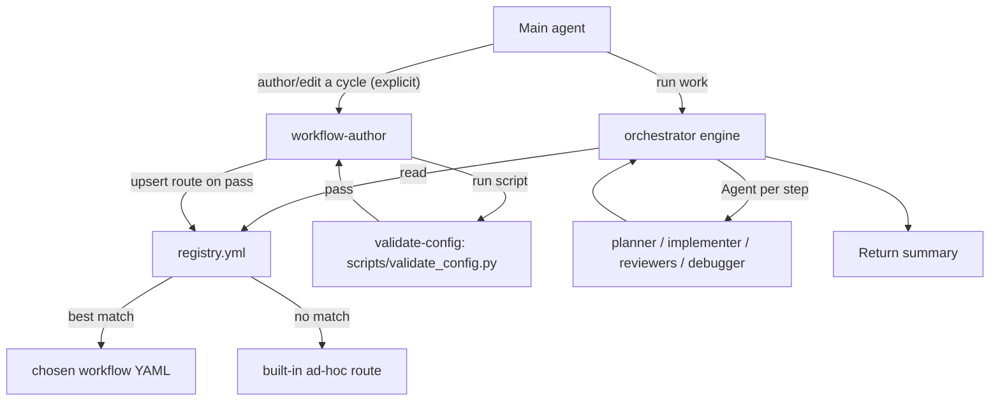

# Orchestral Harness — Detailed Briefing

> Status: **Design/planned.** This document describes the intended design. The agents, skills, and scripts described here are not yet implemented.
>
> Last updated: 2026-07. Claude Code claims verified against the official docs: [Subagents](https://code.claude.com/docs/en/sub-agents) and [Skills](https://code.claude.com/docs/en/skills).

## 0. How this is actually executed (read first)

This harness is **not a compiled engine**. The `.claude/workflows/*.yml`, `registry.yml`, and fields like `match`, `on_complete`, and `max_retries` are **project conventions that the `orchestrator` agent (an LLM) reads and follows via its system prompt** — Claude Code itself has no native knowledge of them and does not parse or execute them.

What actually provides guarantees:

- **Sequence enforcement** comes from the orchestrator's prompt (instruction-adherence), not a state machine.
- **Determinism** comes only from the bundled validation *script* (`validate_config.py`), which is real code.

Read "engine", "gate", and "routing" throughout this doc as *"the orchestrator agent, following its prompt, does X"* — reliable in practice, but model-driven, not mechanically enforced.

## 1. Purpose

A hands-off orchestration layer over the existing `.claude/` agents and skills. The user describes an outcome in plain language; the system routes it to the right workflow and runs that workflow end-to-end, spawning specialist subagents in a fixed, gated sequence that **cannot be skipped**. No `@agent` or skill tagging. New workflows ("cycles") are added declaratively — by asking the AI or copying a template — with **no changes to the orchestrator**.

## 2. Design principles

- **Generic interpreter, not a fixed pipeline.** The orchestrator agent can follow *any* workflow definition, not one specific cycle. (Interpreted by the LLM per §0 — not a compiled engine.)
- **Declarative extensibility.** A cycle = a YAML file + one registry entry.
- **Determinism where it matters.** The one deterministic guarantee is the bundled validation *script*; routing and gating are model-driven.
- **Safe by construction.** Execution and authoring are separated; the orchestrator cannot write files; broken workflows can't be registered (validator-gated).
- **Graceful under failure.** Explicit prompt rules for hard failures, parallel joins, and path resolution.

## 3. Architecture



## 4. Components

| Component | Type | Role |
|-----------|------|------|
| `orchestrator` | agent (execution-only) | Reads the registry, selects a route, runs its steps by spawning agents with prompt-enforced gates. Tools: `Agent, Read, Grep, Glob, TodoWrite` (no Write/Edit/Bash). Model: a capable model (`sonnet`/`opus`) or `inherit` — coordination benefits from stronger reasoning. |
| `workflow-author` | agent (authoring, **privileged**) | Scaffolds a workflow YAML, runs the validator, registers it on pass. Tools: `Read, Write, Edit, Grep, Glob, Bash`; skill `author-workflow`. Note: it can modify `.claude/` config and run shell — scope its `Bash` in `settings.json` (e.g. allow only the validator command). |
| `registry.yml` | config | Routing source of truth: `id`, `workflow`, `description`, `match.intent`, `priority`, `enabled`, plus `fallback: adhoc`. |
| `_template.yml` | template | Copy-to-create a new cycle. Files prefixed `_` are non-routable. |
| `validate-config` | skill + script | `scripts/validate_config.py` checks the whole `.claude` config; exits non-zero on errors only. |
| `dev-cycle.yml` | workflow (example) | Reference workflow: `planning -> review-plan -> task-breakdown -> execute -> review-code + testing -> fix-issues`. |

## 5. Routing (selection algorithm)

1. If the user explicitly names a workflow/route -> use it.
2. Otherwise score each `enabled` route by `match.intent` overlap with the request; highest wins (ties -> `priority`, then list order).
3. No positive match -> built-in **ad-hoc** route automatically.
4. Registry missing/malformed -> ad-hoc + a note in the summary.
5. `_`-prefixed workflow files are ignored everywhere.

**Intent classification (in `CLAUDE.md`):**

- Single-file / ~<=15-line change -> direct Lean execution (no orchestrator).
- Multi-file or "build/implement/fix a feature/bug" -> `orchestrator`.
- Explicit "workflow / cycle / pipeline / route / registry" mention -> `workflow-author`.
- Compound ("author then run") -> author first, then hand the new route to the orchestrator.

## 6. Gates, verdict contracts, and robustness rules

- **Verdict contract.** Any gated step declares the exact tokens its agent returns (e.g. `plan-reviewer` -> `APPROVE` / `APPROVE WITH CHANGES` / `REVISE`). For reliable parsing (the orchestrator only receives the child's free-form summary), each gated agent **must emit a machine-checkable final line**, e.g. `VERDICT: REVISE`, and the orchestrator branches on that line. A verdict outside the contract, or a missing verdict line, is treated as a failure.
- **Hard-failure policy (G-A).** On subagent error/timeout/`maxTurns`/unrecognized verdict: retry once, then stop and report a partial summary — never silently continue.
- **Placeholder resolution (G-C).** `{project-name}` from the repo/`docs/`; `{NN}` = highest existing `docs/specs/phase-*` or `01`. The ad-hoc route uses scratch paths (`docs/plans/adhoc-{slug}-*`), not phase paths.
- **Parallel join (G-D).** Wait for all `parallel_with` steps; pass the gate only if all succeed; failures route to `debugger`, then re-run capped by `max_retries`.
- **Recursion guard.** No step may spawn `orchestrator` or `workflow-author`.

## 7. Usage

**Run work (hands-off):**

> "Add CSV export to the reports page."

-> dev-cycle selected -> plan -> plan-review gate (loops on `REVISE`) -> breakdown -> execute -> review + test concurrently (where background subagents are supported) -> debugger on issues -> summary.

**Trivial edit:**

> "Fix the typo in the login button."

-> direct Lean edit, no orchestration.

**Author a cycle (self-service):**

> "Add a docs cycle."

-> `workflow-author` copies `_template.yml` -> fills steps -> runs `validate_config.py` -> registers the route on pass -> reports.

## 8. Extending the harness

Two ways, both without touching the orchestrator:

- **Ask:** "add a `<name>` cycle that does X -> Y -> Z" — the AI scaffolds and registers it.
- **By hand:** copy `_template.yml` to `.claude/workflows/{id}.yml`, fill the `match` block and `steps` (each `agent`/`skill` must exist; gated steps need a verdict contract), run the validator, add an `enabled` route to `registry.yml`.

## 9. Validation

```bash
python .claude/skills/validate-config/scripts/validate_config.py
```

Checks: frontmatter validity, known fields, agent `skills:` refs, registry -> workflow resolution, step `agent`/`skill` resolution, `fallback` value, recursion guard, and verdict-contract presence. Skips `_*.yml`. Exits non-zero on **errors only** (warnings are informational).

## 10. Caveats

- **Prerequisite: Claude Code >= v2.1.172** (nested subagents). This environment measured **v2.1.89** on 2026-07, which cannot spawn nested subagents, and `autoUpdates` is disabled. **Upgrade before use** (`claude update`, or reinstall the global package), then confirm with `claude --version`. Alternative without upgrading: run `claude --agent orchestrator` as the main session (a main thread can spawn subagents on older versions).
- **Route matching is model-driven** against `match.intent`; naming a workflow always forces it, and ad-hoc keeps things moving when confidence is low.
- **Instruction-adherence, not a hard state machine** (see §0). The guarantee comes from the orchestrator prompt + the validation script, not a compiled engine.
- **Cost and latency.** Each subagent runs in its own context window, so a full cycle (6+ subagents, some concurrent, plus gate loops) multiplies tokens and wall-clock time. This is in tension with the repo's own `CLAUDE.md` Token-Optimization / Lean-profile goals — hence the deliberate escape hatch: trivial/single-file work bypasses the orchestrator and runs directly.
- **Auto-delegation depends on `description` quality.** Claude routes to a subagent based on its `description` field; per the docs, phrasing like "use proactively" improves it. The `orchestrator` and `workflow-author` descriptions must be written for reliable delegation.

## 11. Worked example — a `data-export` cycle (illustrative)

> Illustrative only. This shows how a **non-coding, operational** cycle would be added to the harness without changing the orchestrator. Nothing here is implemented.

**Scenario:** extract data from a web application and export it to CSV, as a repeatable pipeline.

**Why it fits the harness:** the orchestrator only *sequences and gates* agents — so any repeatable process can become a cycle as long as some agent/skill can do the actual work. This example proves the harness generalizes beyond the dev-cycle.

**Capability needed (the one non-trivial part):** the current agents are dev-focused, so the real extraction is done by a new bundled-script skill, e.g. `web-data-extract` (`SKILL.md` + `scripts/extract.py`), invoked by `implementer` (which has `Bash`). The script's implementation depends on how the app's data is reached:

- HTTP/JSON API or DB endpoint -> script uses `requests`/`http`.
- Rendered page / requires login -> script uses browser automation (e.g. Playwright).

**Registry route:**

```yaml
- id: data-export
  workflow: data-export.yml
  description: Extract web application data and export to CSV
  match: { intent: [extract, export, csv, scrape, data pull, report], priority: 60 }
  enabled: true
```

**Workflow skeleton (`data-export.yml`):**

```yaml
name: Data Export Cycle
match: { intent: [extract, export, csv, scrape], priority: 60 }
steps:
  - id: extract
    agent: implementer
    skill: web-data-extract          # NEW skill bundling scripts/extract.py
    action: Pull data from the target web app
    output: "data/exports/{slug}-raw.json"
  - id: to-csv
    agent: implementer
    skill: web-data-extract
    requires: [extract]
    action: Transform and write CSV
    output: "data/exports/{slug}.csv"
  - id: verify
    agent: test-expert
    requires: [to-csv]
    action: Validate row counts, schema, and encoding
    on_complete: { pass: continue, fail: { next: extract, max_retries: 2 } }
```

Output paths (`data/exports/...`) are illustrative — pick a configured location that fits the repo's conventions.

**How it runs (hands-off):** the user says *"export the users data to CSV"*; the orchestrator matches the `data-export` route, runs `extract -> to-csv -> verify`, gates on `verify` (re-running extraction up to twice on failure), and returns a summary with the output path.

**To make it real (future):** (1) add the `web-data-extract` skill + script, (2) author + register `data-export.yml` via `workflow-author` (which validates it), (3) requires the harness itself to be built first.

## 12. Worked example — a document create/review cycle (illustrative)

> Illustrative only. Shows how "AI creates and reviews specific documents that require specific skills" maps onto the harness. Nothing here is implemented.

**Why it fits:** document work maps onto two levels of the harness:

- **Route level (which document):** `registry.yml` `match.intent` sends "write a full spec" -> a spec route, "write a completion report" -> a report route, etc.
- **Step level (which skill):** each workflow step pins the exact `agent` + `skill`, so the correct specialist skill is always used - no tagging, no guessing.

**Most pieces already exist** - a doc cycle mostly wires up existing document-producing agents/skills:

| Document type | Create (agent - skill) | Review / validate |
|---|---|---|
| Full specification | `spec-writer` - `full-specs` | `spec-writer` - `validate-full-specs` |
| Phase / scoped spec | `spec-writer` - `scoped-spec` | `validate-full-specs` |
| Completion report | `phase-manager` - `completion-report` | `check-phase` |
| UI prompt doc | `ui-designer` - `ui-prompt` | design review |
| Code explainer / teaching doc | `implementer` - `explaining-code` | generic docs review |
| Any docs structure / conventions | `docs-context-awareness` guards all of the above | - |

**The one gap - a generic docs reviewer.** Specs have `validate-full-specs` and reports have `check-phase`, but free-form documents (guides, READMEs) have no reviewer. The example adds a small **`docs-review`** skill (reusing `docs-context-awareness` for conventions) plus a reviewer step, mirroring how `plan-reviewer` gates plans. Its verdict contract: `APPROVE` / `REVISE`.

**Pattern (create -> review, skill-pinned).** Per-document-type routes keep each workflow deterministic:

```yaml
name: Spec Document Cycle
match: { intent: [spec, specification, requirements], priority: 55 }
steps:
  - id: create
    agent: spec-writer
    skill: full-specs
    action: Create the specification
    output: "docs/{project-name}-full-spec.md"
  - id: review
    agent: spec-writer
    skill: validate-full-specs      # generic docs use docs-review instead
    requires: [create]
    on_complete: { approve: continue, revise: { next: create, max_retries: 2 } }
```

Sibling routes (`report-cycle`, `ui-doc-cycle`, `generic-docs-cycle`) each pin their own create + review skills. A free-form doc route would use `explaining-code`/author skill to create and the new `docs-review` skill to gate.

**How it runs (hands-off):** the user says *"write the full spec for the export feature"*; the orchestrator matches the spec route, runs `create -> review`, loops on `REVISE` (up to twice), and returns the document path.

**To make it real (future):** (1) add the `docs-review` skill, (2) author + register the per-type doc routes via `workflow-author`, (3) requires the harness itself to be built first.

## 13. Cost efficiency and process optimization

The harness multiplies calls (many subagents, each with its own context window), so cost/latency control is built into the design rather than bolted on.

### Model tiering (the biggest lever)
Match model capability to the job via each agent's `model:` field (or globally with `CLAUDE_CODE_SUBAGENT_MODEL`):

| Role | Model | Why |
|---|---|---|
| Orchestrator route selection | `haiku` / fast | cheap keyword match over `registry.yml` |
| `plan-reviewer`, `code-reviewer` | `haiku` | read-only, diff-scoped scans |
| `validate-config` | none (script) | deterministic code, ~free |
| `planner`, `implementer`, `debugger` | `sonnet` (`opus` only for high-risk) | reasoning-heavy |

**Model validity — confirmed in this environment (2026-07).** The account's usage history (`~/.claude.json`) shows `opus` -> Opus 4.6, `sonnet` -> Sonnet 4.6, and `haiku` -> Haiku 4.5 all actively available; `inherit` is always valid. So every alias used here resolves. `fable`/`best` show no access and are avoided. Each alias auto-resolves to the latest model of that tier, so config stays valid across releases. Notes:

- **Prefer aliases over pinned IDs** (e.g. `claude-opus-4-8`); pinned snapshots go stale, aliases don't.
- `default` reverts to your plan's recommended model; verify or switch any time with `/model`.
- `opusplan` (Opus while planning, Sonnet for execution) is a good fit for planning-heavy runs; available once on the upgraded CLI (>= v2.1.172).
- `best` and `fable` are **plan-gated** and show no access on this account; `haiku`/`sonnet`/`opus` are the safe, confirmed-available choices used here.
- `haiku` is listed under this account's `tool_search_unsupported_models` (no tool-search feature) — fine for the read-only reviewer roles it is assigned.
- `CLAUDE_CODE_SUBAGENT_MODEL` overrides the model for all subagents at once (global cost lever); set it to `inherit` to fall back to normal resolution.

### Tiered execution (skip what you don't need)
- **Trivial** (~<=15 lines / 1 file): no orchestrator — direct Lean edit.
- **Fast lane** (small, low-risk, multi-file): `execute -> review + test` only; skip planning, plan-review, and breakdown.
- **Full cycle**: feature / high-risk / cross-module work only.

The orchestrator picks the tier from size and risk; workflow steps mark themselves `mandatory: false` with a skip condition so a tier can drop them.

### Context economy
- Route from `registry.yml` alone; load **only the selected** workflow file, not all of them.
- Subagents use staged spec loading (read overview/checklist first, then targeted files).
- Pass compact **summaries + file paths** between steps — subagents share no context, so never resend full file contents.
- Scope reviews to the diff (`git diff`), not the whole repo.

### Budget guards
- Per-subagent `maxTurns` and per-gate `max_retries` cap runaway loops.
- Single-pass reviews; skip `debugger` when review + test are clean; skip re-review when plan-review is `APPROVE` with no changes.
- Hard-failure policy stops early with a partial summary instead of thrashing.

### Latency
- Run independent steps concurrently (`parallel_with`, e.g. review + test) where background subagents are supported.

### Incremental validation
- `validate_config.py` takes an optional target-file argument to validate only the changed workflow (fast path during authoring); the full-config scan is reserved for verification/CI.

## 14. Related files

- Plan: `.cursor/plans/orchestrator_subagent_harness_9fab89e0.plan.md`
- Existing workflow definitions: `.claude/workflows/`
- Existing agents/skills: `.claude/agents/`, `.claude/skills/`
